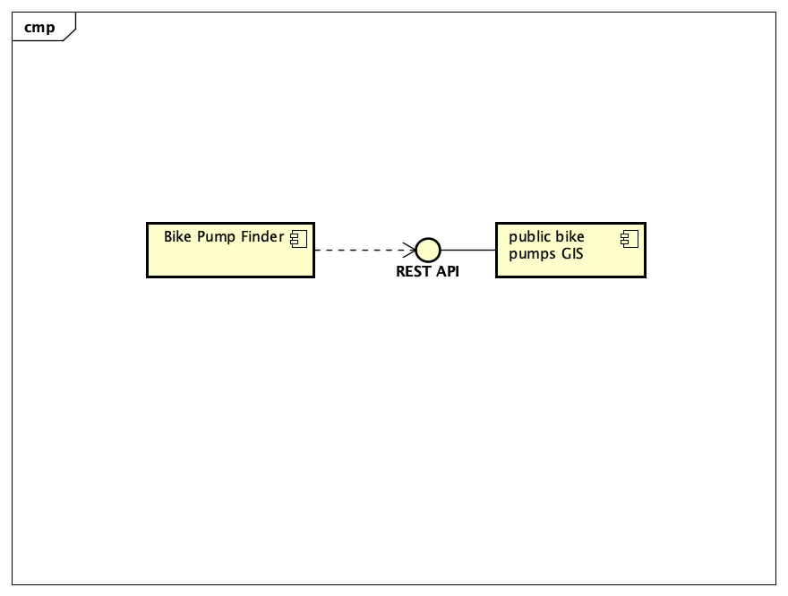
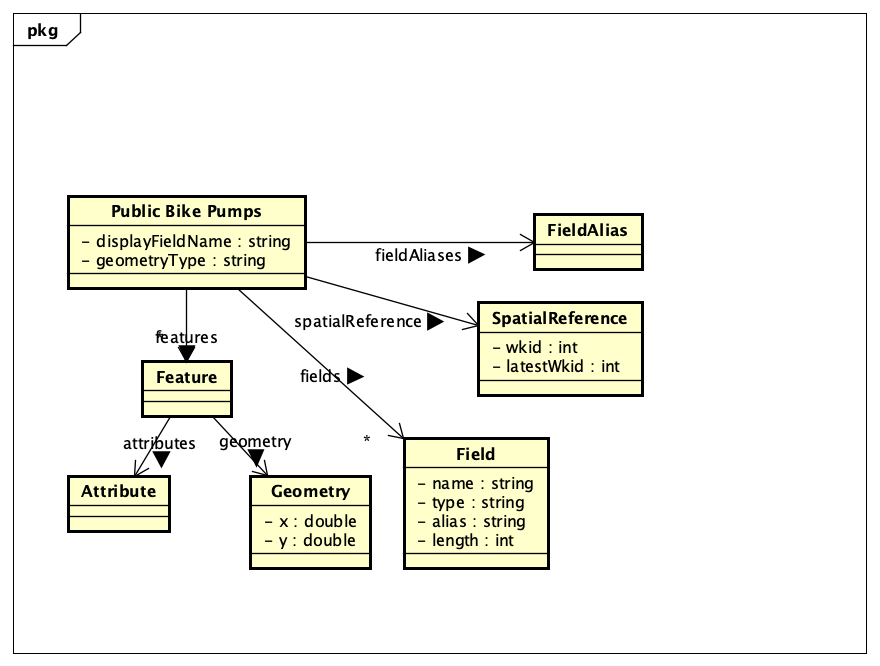

# Implementation

## Introduction
TODO: Describe the system implemented (Describe the dataset. Are there any known issues? Describe any configuration data).

The implemented system is a Car Park Finder web application that retrieves parking information from the Bristol Open Dataset. The dataset includes car park names, types, operator names, number of spaces, operating times, and CCTV availability. This information is displayed in two main sections: an interactive map and a searchable parking information table. During development, no major dataset issues were encountered, and all required fields for the system’s functionality were consistently available. The system relies on several configuration data elements, including the Bristol Open Data API used for the parking information table, default map coordinates, map zoom level, filter categories, and external libraries such as W3CSS and Leaflet. These settings control how the application loads data, displays the map, filters results, and presents parking information through the Car Park Finder.html file.

## Project Structure
TODO: Provide an outline of the project folder structure and the role of each file within it.
provide a table listing the number of jslint warnings/reports for each module.

## Software Architecture
TODO: Describe the major components of your architecture. Are any particular architectural styles being used?

## Bristol Open Data API
TODO: Document each query to Bristol Open Data

TODO: Repeat as necessary

# User guide
TODO: Explain how each use-case works by providing step-by-step screenshots for each use-case. This should be based on a tested scenario.
