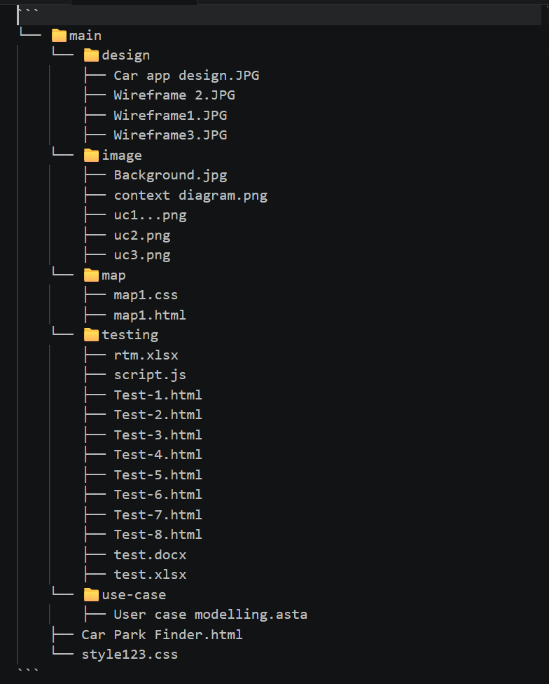
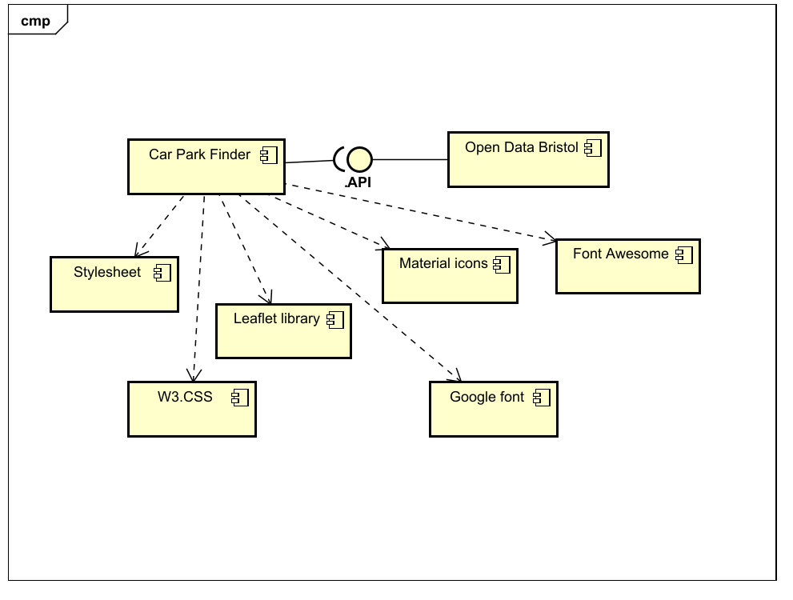
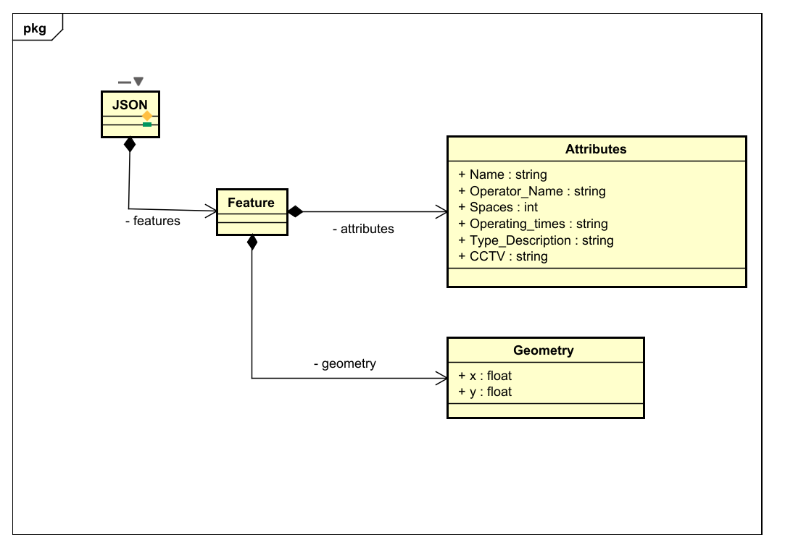
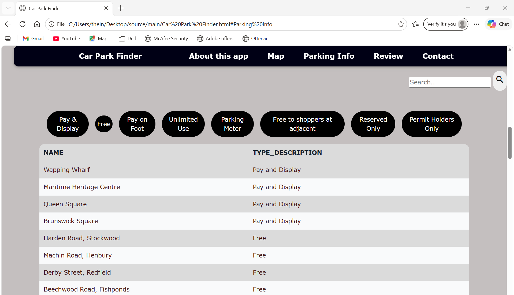
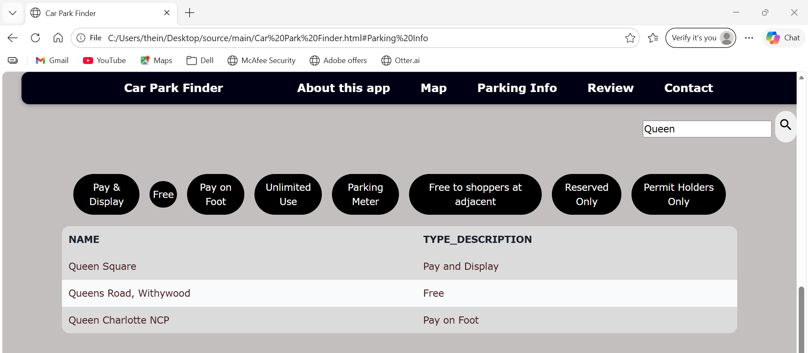
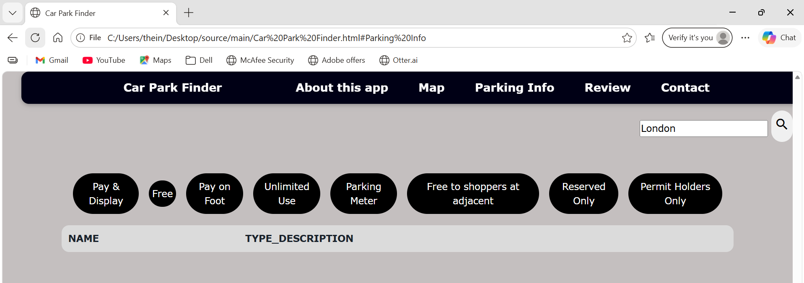
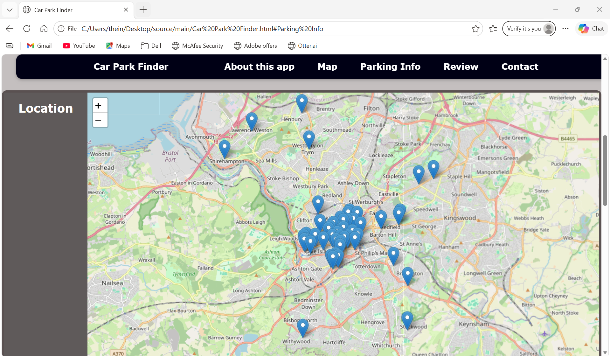
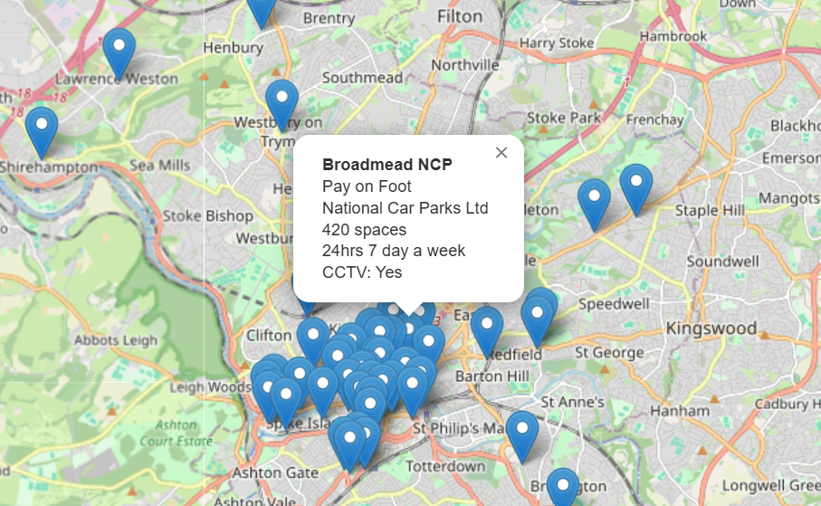
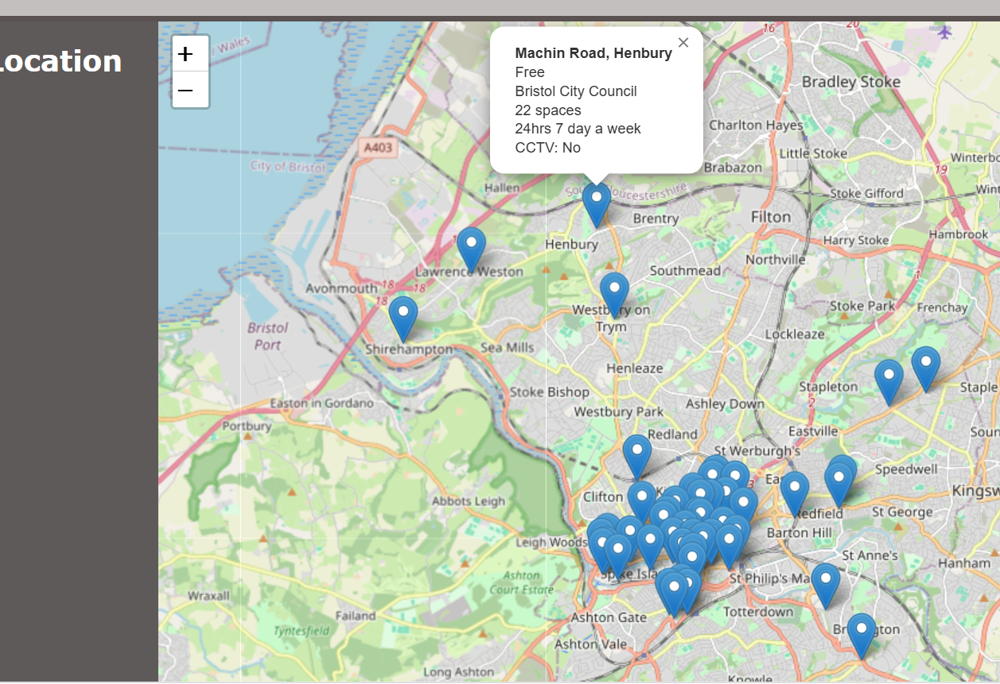

# Implementation

## Introduction
TODO: Describe the system implemented (Describe the dataset. Are there any known issues? Describe any configuration data).

The implemented system is a Car Park Finder web application that retrieves parking information from the Bristol Open Dataset. The dataset includes car park names, types, operator names, number of spaces, operating times, and CCTV availability. This information is displayed in two main sections: an interactive map and a searchable parking information table. During development, no major dataset issues were encountered, and all required fields for the system’s functionality were consistently available. The system relies on several configuration data elements, including the Bristol Open Data API used for the parking information table, default map coordinates, map zoom level, filter categories, and external libraries such as W3CSS and Leaflet. These settings control how the application loads data, displays the map, filters results, and presents parking information through the Car Park Finder.html file.

## Project Structure

This section outlines the project's folder structure and explains the purpose of each file.

## Software Architecture

The diagram below illustrates the major components of the system, including the Car Park Finder interface, the API for retrieving data, and the connection to the Open Data Bristol. It also highlights the external libraries and stylesheets that support the application's visual layout and contribute to a smooth user experience within this architecture.

## Bristol Open Data API

The diagram below represents the JSON structure obtained from the Bristol Open Data API used in Car Park Finder application. It models how the data is organised within the dataset, including JSON object, features, the attributes and geometry. Overall, this diagram illustrates how the dataset is structured and how the system display this information within the application.

# User guide

The following user guide demostrates how each use case operates within the implemented system. Each scenario is provided with step-by-step screenshots to prove the system functions as intended.

### Use-case 1- Search for a car park

1. Parking Info page before search.
   

2. Parking Info page after entering a valid search term.

3. Parking Info page with empty search and no results.

### Use-case 2- View car park's information on Map

1. Map with car park location loaded from dataset

2. During testing, the dataset loaded successfully every time, so the failure scenario (TC2.2) did not occur. Therefore, no screenshot is provided. However, the system is designed to display “No car parks nearby” if the dataset fails to load.

### Use-case 3- View safety information

1. Pop up with CCTV available

2. Pop up with CCTV unavailable

